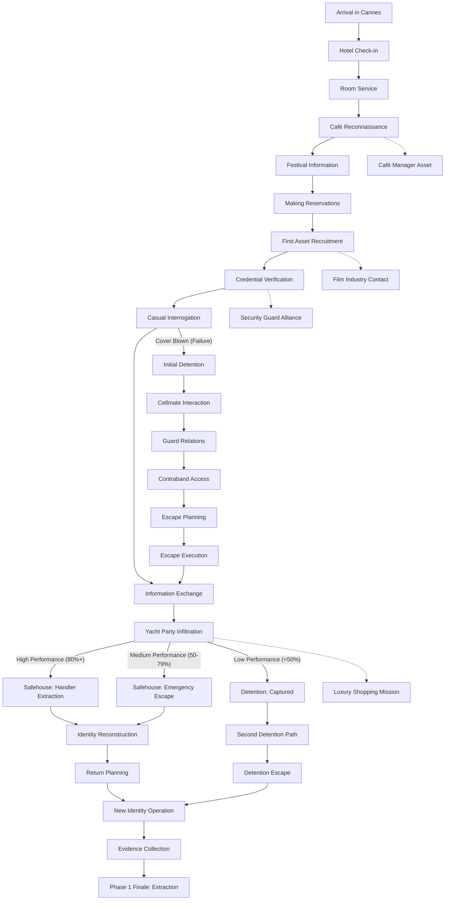

# Dark Mallard: Complete Design Document

## Table of Contents

1. [Project Overview](#project-overview)
2. [Narrative Structure](#narrative-structure)
3. [Core Game Mechanics](#core-game-mechanics)
4. [User Experience & Onboarding](#user-experience--onboarding)
5. [Implementation Plan](#implementation-plan)

---

## Project Overview

Dark Mallard is an innovative language learning application that frames language acquisition as an immersive spy narrative. Players take on the role of an undercover agent, with language proficiency directly tied to mission success and narrative progression.

### Key Differentiators

- **Living Narrative**: Language learning embedded in a responsive storyline with real consequences
- **Consequence System**: Performance affects story direction through Cover Integrity mechanics
- **Multiple Pathways**: Branching storylines based on player performance and choices
- **Emotional Investment**: High-stakes scenarios create genuine motivation for language mastery

---

## Narrative Structure

### Phase 1: Operation Riviera (French)

### Story Structure Breakdown

#### Early Phase (Missions 1-9)

- **Missions 1-7**: Introductory missions with reasonable tolerance for mistakes
  - **Mission 1: Hotel Check-in**: Establish cover identity, basic greetings
  - **Mission 2: Room Service Request**: Build rapport with hotel staff
  - **Mission 3: Café Reconnaissance**: Identify potential assets
  - **Mission 4: Festival Information**: Navigate festival grounds
  - **Mission 5: Making Reservations**: Secure dinner reservation
  - **Mission 6: First Asset Recruitment**: Convince festival volunteer
  - **Mission 7: Credential Verification**: Pass security check
- **Mission 8 (Casual Interrogation)**: First critical point where poor performance can send player to Detention Track
- **Detention Track 1**: Performance-based consequence path for failed missions
- **Mission 9 (Information Exchange)**: Return point where detention escapees rejoin main storyline

#### Mid-Phase Twist Point (Mission 10)

- **Mission 10: Yacht Party Infiltration (INEVITABLE TWIST POINT)**

- **Narrative**: Infiltrate high-security yacht party, but a trusted asset betrays the operation
- **Twist**: Regardless of performance, mission ends in compromise, but *how* it happens depends on skill level
- **Outcome Paths**:
  - **High Performance (80%+ cover)**: Detect betrayal and make controlled exit to safehouse
  - **Medium Performance (50-79%)**: Exposed but escape to safehouse with pursuers
  - **Low Performance (<50%)**: Captured and sent to detention

#### Recovery Paths

**Safehouse Track (Better Performers)**:

- **SH1/SH2**: Initial safehouse arrival (different entry points based on performance)
- **SH3**: Identity reconstruction with handler
- **SH4**: Planning return with new cover identity
- **Outcome**: Smoother return to operation

**Detention Track (Poor Performers)**:

- **DT1-DT6**: Full detention experience
- **Outcome**: More challenging return to operation after escape

#### Late Phase (Missions 11-13)

All players eventually converge back to the main storyline:

- **Mission 11**: New Identity Operation
- **Mission 12**: Evidence Collection
- **Mission 13**: Extraction and Phase 1 conclusion

### Future Language Operations

- Spanish: **Operation Madrid** (Subtitle: "The Royal Deception")
- Italian: **Operation Venezia** (Subtitle: "The Floating Conspiracy")
- Japanese: **Operation Sakura** (Subtitle: "Tokyo Shadow Protocol")

---

## Core Game Mechanics Ideas

### 1. Cover Integrity System

- **Cover Integrity Meter**: Primary performance metric
  - Starts at 100% for each mission
  - Successful dialogues increase CI by 5-10%
  - Mistakes decrease CI by 10-15%
  - CI below 50% triggers increased NPC suspicion
  - CI below 25% risks immediate mission failure
- **Time-Sensitive Responses**: Field conversations include response timer (5-8 seconds)
  - Delayed responses increase suspicion and decrease cover integrity

### 2. Consequence Pathways

When cover is blown, player enters one of two tracks:

#### Detention Track

- **Setting**: Local security holding facility
- **Narrative Focus**: Escape and rebuilding credibility
- **Daily Challenges**:
  - Gain trust with guards through dialogue
  - Build relationships with other detainees
  - Acquire contraband and communication tools
  - Plan and execute escape

#### Safehouse Track

- **Setting**: Network safe house in secluded location
- **Narrative Focus**: Recovery and identity rebuilding
- **Daily Challenges**:
  - Debriefing sessions with handler
  - Identity reconstruction training
  - Cover story rehearsal
  - Return mission planning

### 3. Side Operations System

- Each main mission can unlock 1-2 optional side operations
- Side operations provide:
  - Specialized vocabulary sets
  - Asset relationships
  - Mission advantages
  - Alternate narrative experiences
- Completion optional but enhances main mission success probability

### 4. Learning Integration Features

#### Contextual Learning

- Vocabulary introduced through mission necessity
- Grammar framed as "communication protocols" essential for cover maintenance
- Cultural elements presented as intelligence briefings

#### Spaced Repetition

- "Intelligence Review" sessions recall previously learned material
- Field assets periodically test recall of key phrases
- Previously compromised situations must be replayed until mastered

#### Ghost Mode (Review System)

When in safehouse or detention, player can:

- Review past conversations
- Analyze mistakes
- Practice alternative responses
- Visualize vocabulary connections through an "intelligence mapping" interface

#### Rapport System

- Building relationships with recurring characters through appropriate language use
- Character-specific communication approaches:
  - Formal/respectful
  - Casual/friendly
  - Flirtatious/charming
  - Direct/authoritative

#### Cultural Integration Challenges

- Beyond vocabulary and grammar, players must master cultural elements:
  - Appropriate greeting customs
  - Personal space norms
  - Dining etiquette
  - Register switching based on social context

---

## User Experience & Onboarding

### Cinematic Onboarding Experience

#### First Launch (Full Introduction)

- Full intro video sequence:
  - Incoming transmission → player selection
  - Visuals of the agency
  - Glitches, dossiers, field ops, encrypted feeds
  - Cuts between scenes and UI prompts
  - Dialogue/video pauses → user inputs (e.g., "Accept Mission", "Select Operation")

#### Subsequent Launches

- Shortened cold-open version:
  - 3–5 sec intro sting (logo + encrypted duck eyes + glitch + "Welcome back, Agent")
  - Direct entry into Mission Control

### MVP Implementation Strategy

1. **Intro Video = Stylized Slideshow + Audio + Text Animation**
   - 3–5 animated scenes with voiceover or subtitles
   - Minimal animation with focus on music, glitch cuts, dramatic tone
2. **Trigger Onboarding Flow from Video**
   - Input hotspots within video or synchronized animations
   - Existing screens wrapped in cinematic presentation
3. **Reuse Structure for Future Content**
   - Language arcs, holiday operations, event briefings

### Visual and Audio Direction

#### Visual Style

- High-contrast noir aesthetic
- Red/black color scheme
- Classified document styling
- Grid overlays and scan lines
- Minimalist environmental design with key iconic elements

#### Audio Direction

- Sparse, tension-building ambient sounds
- Notification sounds styled as encrypted communications
- Voice acting for key NPCs with authentic accents
- Success/failure audio cues that reinforce learning moments

---

## Implementation Plan

### MVP Priority Features (5-6 Day Timeline)

1. **Core Loop**: Intelligence → Practice → Field Operation
2. **Consequence System**: Cover integrity meter + basic detention/safehouse mechanics
3. **Limited Asset Network**: 2-3 key NPCs with basic relationship building
4. **Episode 1 Narrative**: Cannes hotel infiltration + first major challenge
5. **Learning Foundation**: Basic vocabulary integration + simple spaced repetition

### Phase 1 MVP Content Scope

1. Main mission track through Mission 6
2. First detention track (DT1-DT3)
3. 2-3 side operations
4. Cover Integrity system
5. Basic dialogue challenge framework

### Future Expansion Features

1. **Expanded Asset Network**: More NPCs with complex relationship webs
2. **Enhanced Consequence System**: More detailed detention/safehouse experiences
3. **Advanced Cultural Integration**: Nuanced cultural challenges
4. **Cross-Operation Connections**: Story elements bridging between language campaigns
5. **Mobile Notifications**: In-character alerts from handler or assets
